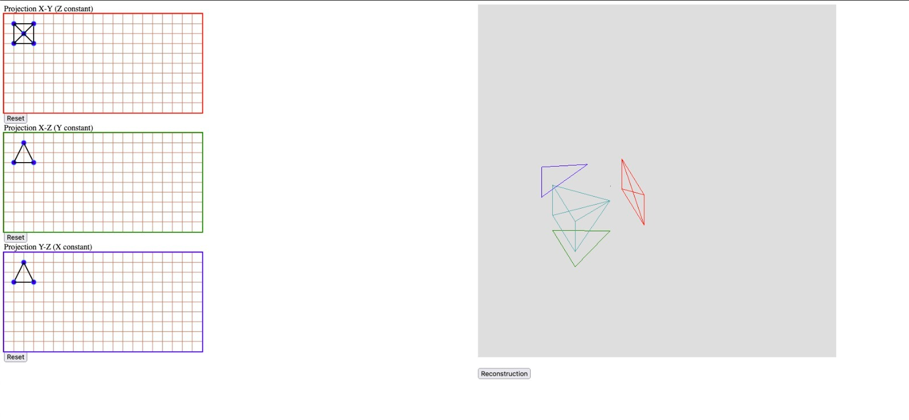
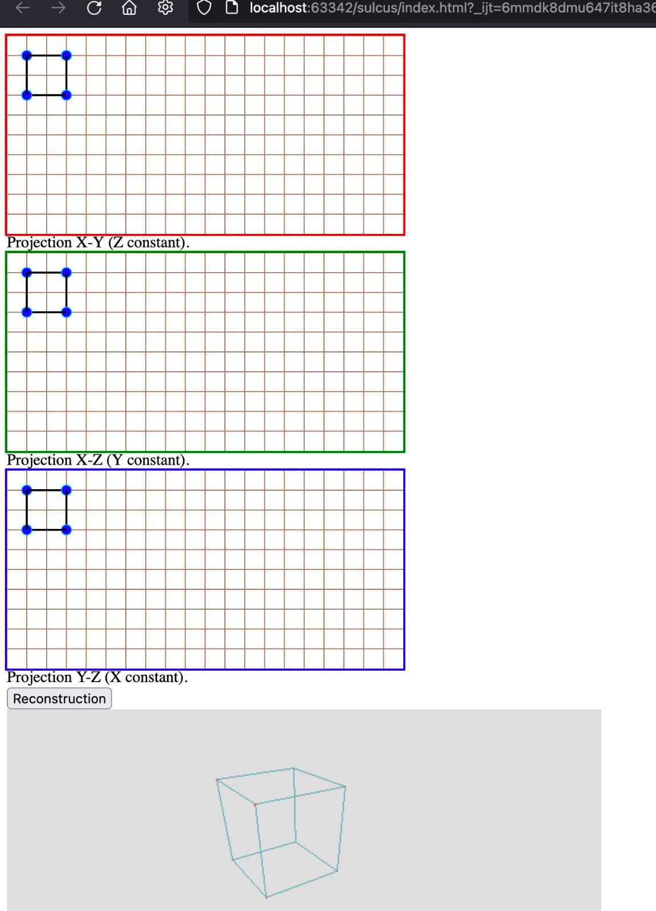

# small-2Dto3D-cad-frontend

See [small-2Dto3D-cad-backend](https://github.com/LouisJULIEN/small-2Dto3D-cad-backend) for documentation.  
This repo is vanilla JavaScript (which is ok for now). It uses [THREE.js](https://threejs.org/) and [TWO.js](two.js.org/) with nothing out of the ordinary.

# Screenshots

# Contributing

Any PR is welcome, feel free to open one! It will be my pleasure to read it, comment it and merge it.